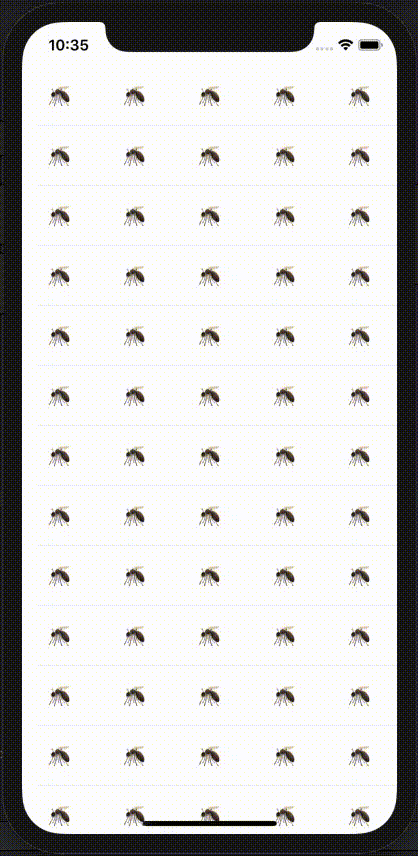

## Table view cell as a container view controller POC

### Goal: Have the taste about how's the implementation of a UITableView using cells that holds a entire UIViewController

### Desired features:
* ~~Display simple UIViewController inside a cell~~
* ~~Keep cell state between reuse~~
* ~~Push/present VC from cells VC~~

### Results to observe:
* How's the table view reload
* How's the code that keeps cell state

| Result |
|---|
|  | 

### Considerations:

1. Keeping MosquitoVC state brings some complexity that isn't that straight
  - If the VC is a little bit more complex (e.g. contains a request) it becomes even hard to save and restore this state when cell is reused or table is reloaded
2. Using VC inside a cell requires more configuration, but it isn't much
